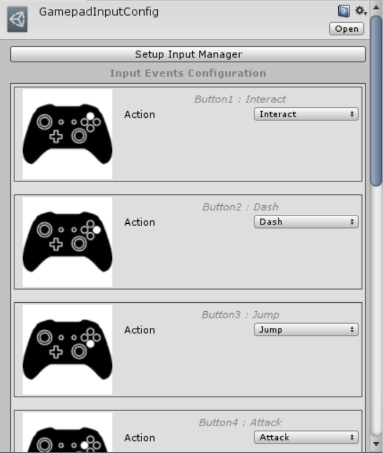

# Unity-Gamepad-Support

A simple solution for handling both Xbox and PS4 gamepads in Unity.
Provides a convenient way of assigning actions to specific gamepad buttons in a form of a custom editor for GamepadInputConfig.asset

Before using a gamepad, it is necessary to configure the Unity Input Manager. To do this, simply click the “Setup Input Manager” button, which you can find at the top of the GamepadInputConfig.asset inspector.

